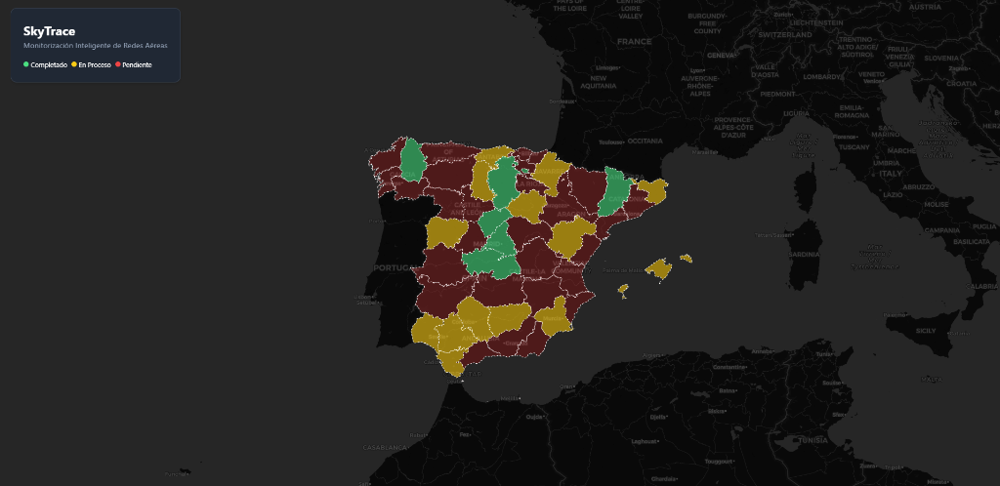

# 🚁 SkyTrace: Aerial Network Monitoring



## 📋 Project Overview

SkyTrace is an interactive dashboard designed for managing and visualizing drone inspections of electrical networks across Spain. It replaces legacy Excel-based workflows with a high-performance, modern web interface.

Key Features:
- **Geographic Visualization**: Interactive map of Spain with real-time inspection statuses (Completed, In Progress, Pending).
- **Province Details**: Detailed analytics panel upon selecting a region (e.g., Madrid, Barcelona).
- **Flight Section Tracking**: Granular tracking of specific flight sections within each province.

## 🚀 Tech Stack

- **React + TypeScript**: For a robust execution environment and type safety.
- **Vite**: For lightning-fast development and build performance.
- **Leaflet / React-Leaflet**: handling mapping and GeoJSON rendering.
- **Modern CSS**: "Glassmorphism" UI methodology with native CSS variables and full responsiveness.

## 🛠️ Installation & Setup

1.  Clone the repository:
    ```bash
    git clone https://github.com/ItsIsrael/skytrace.git
    ```

2.  Install dependencies:
    ```bash
    cd skytrace
    npm install
    ```

3.  Run the development server:
    ```bash
    npm run dev
    ```

## 📬 Contact

Developed by **Israel Ona**.
- **Email**: israel.ona@protonmail.com
- **GitHub**: [ItsIsrael](https://github.com/ItsIsrael)
